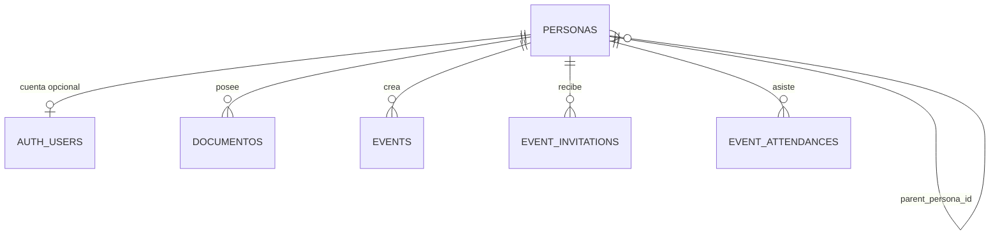

# Modelo de datos vigente

La revisión Alembic `20260920_000008` es el contrato de desarrollo vigente. Es
una migración de retiro **reset-only**: una base con datos aborta en vez de
inferir una conversión. Use el runbook de desarrollo para reiniciar localmente.

## Identidad y jerarquía

`personas` es el único árbol de negocio:

Roles permitidos: `ADMIN`, `COORDINADOR_GENERAL`, `COORDINADOR`, `ENLACE` y
`AMIGO`. Sólo los primeros cuatro pueden tener fila en `auth_users`; el trigger
`trg_auth_user_not_amigo` impide cuentas para `AMIGO` incluso fuera de la API.

## Eventos y documentos

- `events.created_by_persona_id` identifica al propietario y nunca a una cuenta
  heredada.
- Invitaciones y asistencias usan `persona_id`; sus unicidades son por evento y
  persona.
- `documentos.persona_id` y `subido_por_persona_id` son obligatorios. CV y foto
  se versionan por persona y tipo; el binario permanece en S3 privado.
- `event_checkin_tokens.created_by_persona_id` conserva la auditoría del QR.

Las tablas `users`, `politicos`, `lider` e `invitados`, junto con sus FKs,
columnas y enums de compatibilidad, no existen en la cabeza actual.
