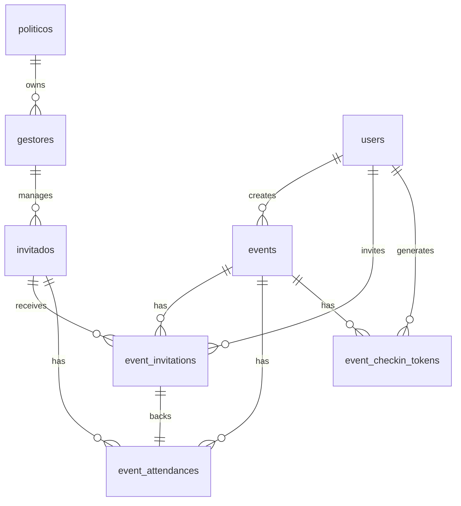

# Base de Datos y Modelo de Datos

## Motor

- PostgreSQL
- Extensión PostGIS habilitada

## Convenciones

- Identificadores UUID
- Fechas en UTC
- Soft delete en `events.deleted_at`
- Versionado optimista en `events.version`
- Restricciones de unicidad y checks a nivel SQL

## Modelo de identidad

### `users`

Cuenta autenticable del sistema.

- `id`
- `email`
- `full_name`
- `password_hash`
- `role`
- `politico_id`
- `gestor_id`
- `invitado_id`
- `created_at`
- `updated_at`

`users` se usa para JWT, login y autorización. La información operativa vive en las tablas de dominio.

### `politicos`

- `id`
- `nombre`
- `apellido_paterno`
- `apellido_materno`
- `telefono`
- `perfil_academico`
- `equipo`
- `enlace`
- `municipio`
- `distrito`
- `seccion`
- `direccion`
- `latitud`
- `longitud`
- `url_imagen`
- `url_cv`
- `fecha_registro`

### `gestores`

- `id`
- `politico_id -> politicos.id`
- `nombre`
- `apellido_paterno`
- `apellido_materno`
- `telefono`
- `perfil_academico`
- `equipo`
- `enlace`
- `municipio`
- `distrito`
- `seccion`
- `direccion`
- `latitud`
- `longitud`
- `url_mapa`
- `url_imagen`
- `url_cv`
- `fecha_registro`

### `invitados`

- `id`
- `gestor_id -> gestores.id`
- `nombre`
- `apellido_paterno`
- `apellido_materno`
- `telefono`
- `perfil_academico`
- `equipo`
- `enlace`
- `municipio`
- `distrito`
- `seccion`
- `direccion`
- `latitud`
- `longitud`
- `url_mapa`
- `url_imagen`
- `url_cv`
- `estatus`
- `fuente_registro`
- `codigo_invitacion`
- `evento_origen_id`
- `asistencias_totales`
- `ultimo_evento`
- `fecha_registro`

## Eventos y asistencia

### `events`

Evento gestionado por un usuario con rol `POLITICO`, `GESTOR` o `ADMIN`.

- `created_by -> users.id`
- `tipo`
- `nombre`
- `descripcion`
- `latitud NUMERIC(9,6)`
- `longitud NUMERIC(10,6)`
- `ubicacion_texto`
- `url_mapa`
- `fecha_inicio`
- `fecha_fin`
- `estatus`
- `capacidad_maxima`
- `requiere_checkin`
- `checkin_abierto_desde`
- `checkin_abierto_hasta`
- `checkin_radio_metros`
- `ubicacion GEOGRAPHY(POINT,4326)`
- `version`
- timestamps

Indices:

- `GIST` sobre `ubicacion`
- índice por `created_by`

### `event_invitations`

Invitación por evento e invitado.

- `evento_id -> events.id`
- `invitado_id -> invitados.id`
- `invitado_por -> users.id`
- `estatus`
- `codigo_invitacion`
- `fecha_invitacion`
- `fecha_respuesta`
- `observaciones`
- timestamps

Restricciones:

- `UNIQUE(evento_id, invitado_id)`
- `UNIQUE(codigo_invitacion)`

### `event_attendances`

Registro de asistencia y check-in.

- `evento_id -> events.id`
- `invitado_id -> invitados.id`
- `invitacion_id -> event_invitations.id`
- `estatus`
- `checkin_at`
- `checkout_at`
- `checkin_metodo`
- `checkin_latitud`
- `checkin_longitud`
- `distancia_evento_metros`
- `registrado_por -> users.id`
- `dispositivo_id`
- `ip_address`
- `user_agent`
- timestamps

Restricciones:

- `UNIQUE(evento_id, invitado_id)`
- `UNIQUE(invitacion_id)`

### `event_checkin_tokens`

Tokens QR efímeros por evento.

- `event_id -> events.id`
- `jti`
- `expires_at`
- `created_by -> users.id`
- `revoked_at`
- timestamps

Restricciones:

- `UNIQUE(jti)`

## Diagrama

## Notas PostGIS

- La ubicación del evento se construye como `POINT(longitud, latitud)`.
- La distancia para check-in geográfico debe calcularse en backend con PostGIS.
- La geolocalización es un control complementario y no debe tratarse como prueba absoluta de presencia.

## Estados de negocio

- `user_role`: `POLITICO`, `GESTOR`, `INVITADO`, `ADMIN`
- `event_status`: `BORRADOR`, `PUBLICADO`, `EN_CURSO`, `FINALIZADO`, `CANCELADO`
- `invitation_status`: `PENDIENTE`, `ACEPTADA`, `RECHAZADA`, `CANCELADA`, `EXPIRADA`
- `attendance_status`: `INVITADO`, `CONFIRMADO`, `PRESENTE`, `AUSENTE`, `CANCELADO`
- `checkin_method`: `QR`, `MANUAL`, `GEOLOCALIZACION`, `CODIGO`, `ADMIN`
