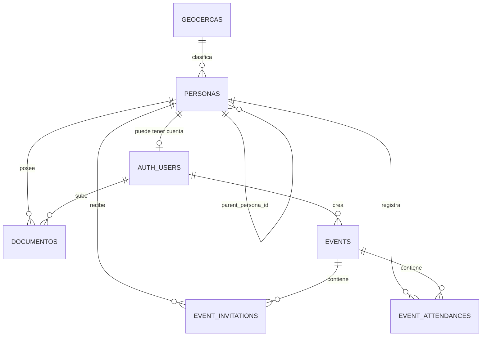

# TRA-92 — Diagnóstico y diseño del dominio Persona/Auth jerárquico

**Estado:** diseño aprobado para implementación posterior; este documento no ejecuta cambios de esquema ni operaciones destructivas.
**Base revisada:** `origin/main` de `aditsystem-backend`, `aditsystem-infrastructure` y `ADITSYSTEM`, 19 de septiembre de 2026.

## Decisiones contractuales definitivas

| Concepto | Valor contractual |
| --- | --- |
| Roles autenticables | `ADMIN`, `COORDINADOR_GENERAL`, `COORDINADOR`, `ENLACE` |
| Persona no autenticable | `AMIGO`: no credenciales, contraseña, JWT ni endpoint de login |
| Jerarquía funcional | `COORDINADOR_GENERAL → COORDINADOR → ENLACE → AMIGO` |
| ADMIN | Administración global, fuera del árbol funcional; autenticable, auditable y no limitado por ownership |
| Fuente del rol | `personas.rol`; `auth_users` no duplica el rol |
| Baja | Lógica (`deleted_at` y estado); no es eliminación física ni despublicación |
| Fotografía/CV | Metadatos versionados en documentos privados; nunca URL pública persistente ni binario en DB |

Los nombres `GENERAL_COORDINATOR`, `LINK`, `FRIEND`, `POLITICO`, `LIDER` e `INVITADO` son legado y **no deben aparecer en el nuevo contrato, OpenAPI, JWT, seeds, tests ni frontend**. No existe mapeo de compatibilidad: `GENERAL_COORDINATOR` se reemplaza por `COORDINADOR_GENERAL`; `LINK` por `ENLACE`; `FRIEND` se elimina y `AMIGO` no es usuario.

## Evidencia del estado actual

El backend es FastAPI/Pydantic/SQLAlchemy async sobre PostgreSQL 16 + PostGIS, con Alembic. El frontend es React/Vite/TypeScript y la infraestructura es Terraform con RDS PostgreSQL 16, EC2 y S3 privado para media.

### Identidad, jerarquía y referencias legacy

| Evidencia | Hallazgo | Decisión |
| --- | --- | --- |
| `models/user.py` | `users` tiene tres FK opcionales (`politico_id`, `lider_id`, `invitado_id`) y `role`; nada exige exactamente una asociación ni evita asociaciones incompatibles. | Reemplazar por `auth_users.persona_id UNIQUE NOT NULL`. |
| `models/enums.py` | Enum vigente: `ADMIN`, `GENERAL_COORDINATOR`, `COORDINATOR`, `LINK`, `FRIEND`. | Sustituir por `person_role` con los cinco nombres contractuales; no crear enum de rol en `auth_users`. |
| `models/politico.py` + migración `000004` | Sólo modela dos niveles en `politicos`: `GENERAL_COORDINATOR → COORDINATOR`. | Reemplazar por un árbol único de personas de cuatro niveles. |
| `models/lider.py` | `lider.politico_id` ata el actual enlace a un político, no necesariamente a un coordinador. | Sustituir por `personas.parent_persona_id` con padre `COORDINADOR`. |
| `models/invitado.py` | El amigo actual pertenece a `lider`; existe `users.invitado_id` y auto-registro `FRIEND`. | Reemplazar por `AMIGO` hijo de `ENLACE`, sin `auth_users`. |
| `services/*` | Las comprobaciones por rol y ownership son dispersas; `COORDINATOR` puede listar amigos globalmente (`InvitadoService.list_invitados`) y gestionar cualquier amigo. | Centralizar policy/consulta de descendencia; validar alcance por persona objetivo. |
| `services/documento.py` | Documento polimórfico `entity_type/entity_id`, sin FK, permite autorización amplia por tipo. | Reemplazar por FK `documentos.persona_id`. |
| `services/auth.py`, `schemas/auth.py`, `api/.../auth.py` | `/auth/register` crea `FRIEND` autenticable; admin puede crear cualquier combinación de rol y FK. | Eliminar registro público y crear cuentas sólo en flujo administrativo/controlado. |
| `alembic/000004`, `000005` | Migran y remapean roles legacy (`POLITICO→COORDINATOR`, `LIDER→LINK`, `INVITADO→FRIEND`). | No reutilizar ni ejecutar esa cadena para el esquema nuevo; nuevo baseline limpio. |

## Inventario de esquema actual

Todos los identificadores son UUID. `created_at`/`updated_at` usan `now()` en tablas que incorporan `TimestampedModel`; `deleted_at` es baja lógica donde aparece. No se observaron triggers definidos por las migraciones.

| Tabla | PK, FK y relaciones | Índices / constraints relevantes | Estado frente al nuevo modelo |
| --- | --- | --- | --- |
| `users` | PK `id`; FK opcionales a `politicos`, `lider`, `invitados`; `events.created_by`, invitaciones, check-in y documentos lo referencian. | `UNIQUE(email, politico_id, lider_id, invitado_id)`; índice no único `email`; enum `user_role`. | Reemplazar por `auth_users` 1:1 con persona. |
| `politicos` | PK `id`; self-FK `parent_politico_id`; padre/hijos; `lider.politico_id`. | índice `parent_politico_id`; check antiautopadre; enum `tipo_politico`; soft delete. | Reemplazar; su perfil común pasa a `personas`. |
| `lider` | PK `id`; FK `politico_id`; padre de `invitados`. | índice `politico_id`; soft delete. | Reemplazar por personas `ENLACE`. |
| `invitados` | PK `id`; FK `lider_id`; referencia de invitación/asistencia. | índices `lider_id`, `evento_origen_id`; `UNIQUE(codigo_invitacion)`; soft delete. | Reemplazar por personas `AMIGO`; actualizar FK de eventos. |
| `documentos` | PK `id`; FK `subido_por→users`; objetivo polimórfico sin FK. | índices `entity_type`, `entity_id`; enum `entity_type`, `documento_tipo`; soft delete. | Reemplazar por FK de persona y unicidad de versión/corriente. |
| `events` | PK `id`; FK `created_by→users`; padre de invitaciones/asistencias/tokens. | GIST `ubicacion`; índice `created_by`; checks de coordenadas, capacidad y radio; enum `event_status`; soft delete y lock `version`. | Conservar el dominio; cambiar auditoría a `auth_users`. |
| `event_invitations` | FK a `events`, `invitados`, `users`. | `UNIQUE(evento_id,invitado_id)`, `UNIQUE(codigo_invitacion)`; índices de ambos FK de consulta; enum de estado. | Cambiar receptor a `persona_id` (sólo AMIGO validado). |
| `event_attendances` | FK a `events`, `invitados`, `event_invitations`, `users`. | `UNIQUE(evento_id,invitado_id)`, `UNIQUE(invitacion_id)`; índices de evento/amigo; enum estado y método. | Cambiar amigo a persona y actor a auth user. |
| `event_checkin_tokens` | FK a evento y usuario creador. | `UNIQUE(jti)`, índice `event_id`. | Conservar; actor cambia a `auth_users`. |
| `geocercas` | PK `id`, sin FK entrantes hoy. | GIST geometría; `UNIQUE(hash_geometria,tipo)`; índices tipo, códigos y vigente; enum `tipo_geocerca`. | Reutilizar como catálogo geográfico referenciable por personas. |

Enums auxiliares reutilizables: `event_status`, `invitation_status`, `attendance_status`, `checkin_method`, `tipo_geocerca`. Deben revisarse sus FKs y nombres al baselinar; `user_role`, `tipo_politico`, `entity_type` y los nombres de entidad documental son reemplazados. `estatus` es actualmente texto en tres tablas y `EstatusPersona` sólo es una validación de aplicación: deberá convertirse en enum/constraint único de personas.

Las cinco migraciones actuales son `20260726_000001` (esquema inicial), `20260915_000002` (soft delete/documentos), `20260919_000003` (geocercas), `20260919_000004` (roles/parent político) y `20260919_000005` (remapeo/drop roles). La documentación `docs/database.md` aún describe los roles previos y `lideres`, por lo que no es fuente contractual vigente.

## Modelo de destino

### Tablas y garantías propuestas

| Tabla | Campos principales | Reglas obligatorias |
| --- | --- | --- |
| `personas` | `id`, `rol person_role`, nombre, apellidos, teléfono, perfil académico, equipo, contacto, dirección, `municipio_geocerca_id`, `distrito_geocerca_id`, sección, latitud/longitud, `parent_persona_id`, `estatus_persona`, `created_at`, `updated_at`, `deleted_at`. | Nombres/teléfono no nulos conforme al contrato actual; checks de lat/long; FK a geocercas y self-FK; índice por padre, rol, estado y geografía. |
| `auth_users` | `id`, `persona_id`, `email`, `password_hash`, `is_active`, `last_login_at`, timestamps. | `UNIQUE(persona_id)` y email case-insensitive único; trigger que rechaza cuenta cuando la persona es `AMIGO` o está eliminada; token se emite sólo si cuenta y persona están activas. |
| `documentos` | `id`, `persona_id`, `tipo`, `original_filename`, `storage_key`, `mime_type`, `size_bytes`, `version`, `is_current`, `created_by_auth_user_id`, timestamps, `deleted_at`. | FK reales; `UNIQUE(persona_id,tipo,version)` y índice parcial único de documento actual por `(persona_id,tipo)`; objeto sólo en S3 privado. `CV` y `FOTO` son tipos, no columnas URL. |
| Eventos/asistencia | Sustituir referencias `invitado_id` por `persona_id` y referencias actor por `auth_user_id`. | Trigger/policy de servicio impide asociar persona que no sea `AMIGO` a invitación/asistencia; mantener unicidades de evento/persona. |

El trigger de jerarquía debe rechazar ciclos, self-parent y combinaciones fuera de: `COORDINADOR_GENERAL` raíz; `COORDINADOR` hijo de general; `ENLACE` hijo de coordinador; `AMIGO` hijo de enlace; `ADMIN` raíz. No se permite reparenting que produzca una subestructura inválida. `ADMIN` no se usa como padre organizacional.

La fotografía se obtiene mediante endpoint autorizado que entrega URL presignada temporal, no a través de `url_imagen`. El CV conserva toda versión; una carga crea una nueva versión y desmarca la previa de manera transaccional. Los datos de dirección/coordenadas actuales se conservan bajo `personas`; municipio y distrito dejan de ser texto libre cuando exista geocerca correspondiente, manteniendo la sección textual por falta de catálogo actual.

## RBAC y ownership

| Actor | Crear/actualizar/baja | Lectura | Documentos, CV y foto | Alcance |
| --- | --- | --- | --- | --- |
| `ADMIN` | Cualquier persona/cuenta/relación válida | Todo | Todo | Global; no omite auditoría ni validaciones. |
| `COORDINADOR_GENERAL` | Sus coordinadores y descendientes según operación | Su subárbol | Su perfil y subárbol | Sólo descendientes del mismo general. |
| `COORDINADOR` | Sus enlaces y amigos descendientes | Su subárbol | Su perfil y subárbol | No hermanos ni otro coordinador. |
| `ENLACE` | Sus amigos; su perfil | Sí mismo y sus amigos | Sí mismo y sus amigos | No amigos de otro enlace. |
| `AMIGO` | No autentica ni ejecuta operaciones | No acceso directo | Sin acceso directo | Su información la opera actor autorizado. |

Todas las consultas de lectura/listado deben iniciar con el filtro de descendencia, no filtrar objetos tras recuperarlos. La autorización se resuelve contra el `persona_id` de `auth_user` en BD (el `role` del JWT es sólo una pista de sesión, no fuente de ownership). La baja lógica de una persona debe desactivar/invalidar su cuenta y bloquear creación de nuevos descendientes; la eliminación física sólo será una operación administrativa documentada y no la respuesta normal de API.

## Breaking changes y reemplazos necesarios

1. Se retiran tablas/DTO/rutas `politicos`, `lideres` y `invitados`; el frontend consume `personas` y sus vistas filtradas por rol/alcance.
2. Se retiran `POST /auth/register`, `invitado_id` en token/usuario y cualquier login de `FRIEND`; la creación de una cuenta es un acto administrativo sobre una persona autenticable.
3. JWT y OpenAPI pasan a los cuatro roles canónicos; JWT incluye `sub=auth_user_id`, `persona_id` y `role` derivado. La dependencia de autenticación valida cuenta/persona activas.
4. `entity_type/entity_id`, `url_imagen`, `url_cv` y `url_mapa` polimórficos se sustituyen por relaciones de persona/documento. Los clientes no envían `s3_key` libremente: el backend controla prefijo y finaliza carga autorizada.
5. Eventos e historial de asistencia se preservan funcionalmente pero sus FKs de amigos/auditoría cambian. Por ser reset total, no hay migración de datos ni capa de compatibilidad.
6. Mocks y tipos frontend que aún expresen `GENERAL_COORDINATOR`, `LINK` o `FRIEND` se eliminan en el mismo PR de contrato; no se traducen silenciosamente.

## Estrategia de migraciones y reset

### Baseline

Al no requerirse conservar datos, la siguiente implementación crea un **nuevo baseline Alembic de una sola cabeza** que contiene el esquema de destino, PostGIS y todos los enums finales. Las cinco migraciones actuales se archivan fuera de la cadena activa sólo dentro del PR de reset y nunca se combinan con migración de datos. `alembic upgrade head` desde una BD vacía es la prueba de aceptación. El rollback de este lanzamiento es restaurar el snapshot previo y la imagen/backend previa, no ejecutar downgrade sobre datos nuevos.

### Reset local reproducible

No ejecutar automáticamente desde CI. Tras implementar el script/comando explícito, el procedimiento local será:

1. Confirmar que `APP_ENV=local`, host local/servicio Compose `db` y nombre de BD esperado; abortar en cualquier otro valor.
2. Detener API y migrations: `docker compose down`.
3. Opcionalmente exportar backup local; nunca usar credenciales remotas.
4. Ejecutar el comando propuesto `./scripts/reset-local-db.sh --confirm-local-reset`; el script sólo aceptará el volumen nombrado `aditsystem-postgres-data`, validará el entorno y ejecutará `docker compose down --volumes`.
5. Levantar `docker compose --env-file .env.compose up --build`; Alembic aplica el baseline desde vacío.
6. Sembrar sólo cuentas ficticias mediante el CLI administrativo y validar `GET /health`, `alembic current`, login ADMIN y los cuatro niveles de jerarquía.

### Reset remoto development (sólo procedimiento documentado)

**OPERACIÓN DESTRUCTIVA — prohibida en producción.** No habrá `DROP`, `aws rds delete-db-instance`, `terraform destroy` ni comando de reset en el pipeline normal. La ejecución futura exige una runbook aprobada, ventana de cambio y estos cerrojos acumulativos:

1. Operador con rol de break-glass, MFA y cuenta AWS permitida; comprobar `sts get-caller-identity` contra la cuenta development autorizada.
2. Leer tags/ARN de RDS y exigir exactamente `Environment=dev`, identificador allowlisted y un argumento literal `--environment development --confirm-reset <rds-identifier>`; abortar si contiene `prod` o no coincide.
3. Verificar que el workspace/branch y backend Terraform son `environments/dev`; producción no comparte credenciales, perfil ni script.
4. Crear snapshot manual etiquetado y registrar Change ID; detener escritor backend por SSM antes de tocar la BD.
5. Ejecutar exclusivamente una automatización revisada por PR mediante SSM dentro de la VPC, con timeout, log CloudWatch y doble confirmación humana. No exponer RDS ni copiar contraseñas.
6. Aplicar backend compatible, baseline/migraciones y seed ficticio; desplegar frontend compatible; ejecutar smoke tests, revisar logs/métricas y reabrir tráfico.
7. Si falla, restaurar snapshot al RDS de development o recrear desde Terraform y desplegar la imagen previa. Producción queda fuera de alcance.

## Riesgos y controles

| Riesgo | Control |
| --- | --- |
| Datos o roles legacy sobreviven en código | `rg` de términos bloqueados, pruebas OpenAPI/JWT y revisión de migrations/seeds/frontend. |
| Escalada horizontal por filtros incompletos | Policy central, consultas de descendencia y tests de denegación por cada borde del árbol. |
| AMIGO obtiene token | Sin rol en `auth_users`, trigger de BD y tests que esperan 401/403 para login/registro. |
| Documento de otra persona o llave S3 arbitraria | FK `persona_id`, autorización de subárbol, prefijo generado por servidor y URL presignada. |
| Reset llega a producción | No automatización normal; tags/allowlist/MFA/snapshot/doble confirmación/SSM y entorno separado. |
| Downgrade de enum PostgreSQL | Baseline nuevo y rollback por snapshot/imagen; no downgrade lógico entre contratos incompatibles. |

## Plan de ejecución, dependencias y PRs

| Orden | Tarea / responsable | Prioridad | Dependencia | PR propuesto (repositorio; archivos principales) | Aceptación |
| --- | --- | --- | --- | --- | --- |
| 1 | Baseline de Persona/Auth + reset protegido — Claude | P0 | TRA-92 | `aditsystem-backend`; `models/*`, `alembic/*`, `scripts/reset-local-db.sh`, `docs/*` | BD vacía llega a head; no enums/tablas legacy; reset local exige confirmación. |
| 2 | Repositorios, schemas, servicios y policy RBAC/ownership — Claude | P0 | 1 | `aditsystem-backend`; `schemas/*`, `repositories/*`, `services/*`, `api/*` | Matriz RBAC completa, AMIGO sin cuenta y controles de subárbol. |
| 3 | Eventos, invitaciones, asistencia y documentos contra Persona — Claude | P0 | 1–2 | `aditsystem-backend`; modelos/servicios/endpoints/tests de eventos/documentos | FK de persona y auditoría correctas; versiones de CV/foto. |
| 4 | Contrato OpenAPI y pruebas de seguridad/integración — Claude | P0 | 2–3 | `aditsystem-backend`; tests, OpenAPI docs | No cadenas legacy; 401/403 y límites de ownership probados. |
| 5 | Cliente HTTP, tipos, flujos de personas/jerarquía y eliminación de mocks — Codex | P0 | 4 | `ADITSYSTEM`; `src/api/*`, `src/types/*`, pantallas/forms/tests | Sólo roles finales; estados de carga/error; sin doble submit. |
| 6 | Carga/lectura segura de foto, CV y documentos en frontend — Codex | P1 | 3–5 | `ADITSYSTEM`; pantallas/API/tests | UI respeta permisos y versiones; no expone claves S3. |
| 7 | Runbook development y controles de despliegue/migración — Codex | P1 | 1, 3 | `aditsystem-infrastructure`; `docs/*`, workflows/scripts si se aprueban | Pipeline normal no destruye; runbook tiene todos los cerrojos definidos. |
| 8 | Observabilidad de autorización y reset; revisión final — Codex revisa / Claude corrige backend | P1 | 4–7 | repositorios afectados | Logs sin PII/secreto, auditoría de mutaciones y smoke test completo. |

Critical path: 1 → 2 → 3 → 4 → 5. No debe iniciarse UI contra contrato definitivo antes de que 4 publique OpenAPI. Cada PR es dedicado; no mezclar baseline con cambios UI o Terraform.

## Definition of Done de la siguiente etapa

- Nuevo esquema se crea desde vacío con una sola cabeza Alembic y datos de prueba no personales.
- Sólo cuatro roles autenticables aparecen en BD, OpenAPI, JWT, API, frontend y tests; AMIGO no tiene filas de autenticación.
- Todas las operaciones de persona/documento/evento evalúan RBAC y ownership de subárbol en servidor, con casos positivos y negativos.
- Documento/CV/foto tienen FK, versionado, auditoría y almacenamiento privado; ninguna respuesta persiste una URL pública ni llave arbitraria del cliente.
- Documentación de reset local y remoto incluye protecciones descritas; CI/despliegue ordinario no es destructivo.
- Frontend consume el contrato final sin mocks legacy y la suite de integración cubre ADMIN, cada borde jerárquico y denegación horizontal.

## Preguntas exclusivas para Product Owner

No quedan decisiones pendientes de persona, autenticación, ownership o nomenclatura. Sólo se requiere confirmar antes de UI/seed: (1) catálogo permitido de tipos de documento adicionales a CV/FOTO/IDENTIFICACION/OTRO; (2) política de retención legal y si una baja lógica puede restaurarse; (3) nombres, cantidad y datos ficticios de las cuentas seed de development; y (4) si un COORDINADOR_GENERAL puede crear directamente ENLACES/AMIGOS o sólo administrar su estructura por delegación. La propuesta actual permite administración de descendientes, con ENLACE como propietario directo de AMIGO.
